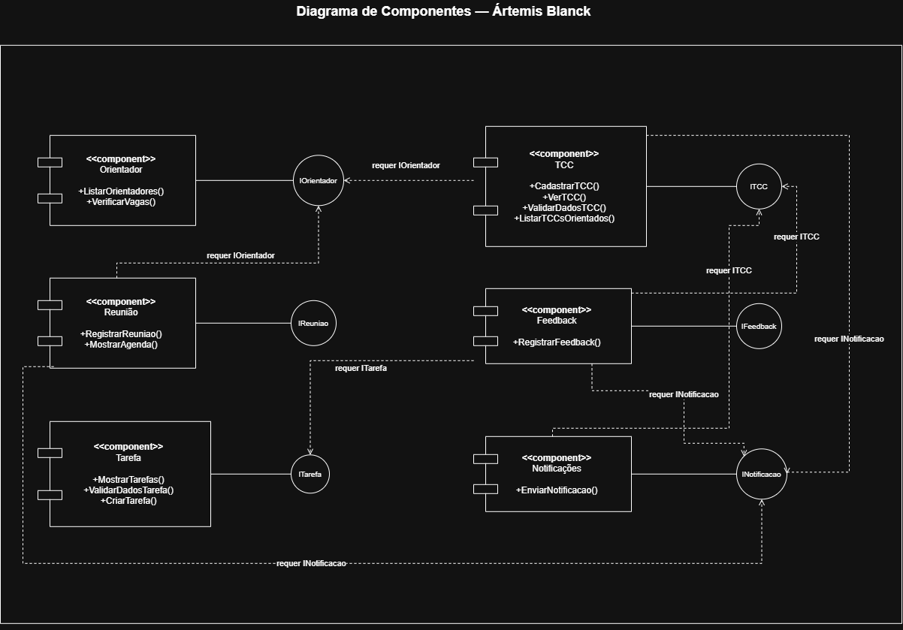

# Modelagem de Componentes

## 1. Análise dos Fluxos dos Casos de Uso

### Aplicar Feedback

| Caso de Uso | Fluxo analisado | Operação identificada |
|---|---|---|
| Aplicar Feedback | 1. O orientador deve realizar login na plataforma. 2. O orientador deve acessar a lista de TCCs sob sua orientação. 3. O sistema deve mostrar os TCCs vinculados àquele orientador. 4. O orientador deve selecionar um TCC. 5. O sistema mostra o quadro com as tarefas daquele TCC. 6. O orientador seleciona a tarefa que deseja avaliar. 7. O orientador escreve o feedback no campo de escrita. 8. O orientador deve selecionar a opção de "Enviar Feedback". 9. O sistema valida as informações. 10. O sistema registra o feedback. 11. O sistema disponibiliza o feedback ao aluno e o notifica por e-mail. 12. O sistema confirma a aplicação do feedback. | 3: `+ListarTCCsOrientados()` 5: `+MostrarTarefas()` 9: `+ValidarDadosFeedback()` 10: `+RegistrarFeedback()` 11: `+EnviarNotificacao()` |

### Criar Tarefa

| Caso de Uso | Fluxo analisado | Operação identificada |
|---|---|---|
| Criar Tarefa | 1. O aluno deve fazer login na plataforma. 2. O aluno deve acessar o seu TCC. 3. O sistema mostra as informações do TCC. 4. O aluno deve entrar na aba tarefas. 5. O sistema mostra o quadro de tarefas do seu TCC. 6. O aluno deve clicar em criar tarefa. 7. O aluno informa os dados associados à tarefa. 8. O aluno clica em confirmar. 9. O sistema valida os dados informados. 10. O sistema cria a tarefa com status "A Fazer". | 3: `+VerTCC()` 5: `+MostrarTarefas()` 9: `+ValidarDadosTarefa()` 10: `+CriarTarefa()` |

### Cadastrar TCC

| Caso de Uso | Fluxo analisado | Operação identificada |
|---|---|---|
| Cadastrar TCC | 1. O aluno deve fazer login na plataforma. 2. O aluno deve entrar na aba de cadastrar TCC. 3. O sistema apresenta o formulário de cadastro de TCC. 4. O aluno informa o título e demais informações sobre o TCC. 5. O aluno clica para selecionar um orientador. 6. O sistema mostra a lista de orientadores. 7. O aluno seleciona um orientador. 8. O sistema verifica se o orientador possui vagas. 9. O aluno confirma o cadastro de TCC. 10. O sistema valida as informações. 11. O sistema envia uma solicitação para o professor orientador. 12. O sistema confirma o envio da solicitação. 13. O orientador aceita a solicitação. 14. O sistema registra o TCC e o associa ao aluno e ao orientador. | 6: `+ListarOrientadores()` 8: `+VerificarVagas()` 10: `+ValidarDadosTCC()` 11: `+EnviarNotificacao()` 14: `+CadastrarTCC()` |

### Agendar Reunião

| Caso de Uso | Fluxo analisado | Operação identificada |
|---|---|---|
| Agendar Reunião | 1. O aluno realiza o login na plataforma. 2. O aluno acessa a opção "Orientadores". 3. O sistema apresenta a lista de orientadores cadastrados. 4. O aluno verifica as informações dos orientadores, como área de atuação e número de vagas. 5. O aluno seleciona um orientador. 6. O sistema apresenta as informações do orientador e abre o calendário com os horários disponíveis. 7. O aluno seleciona um horário. 8. O aluno confirma o agendamento. 9. O sistema registra a reunião associada ao aluno e orientador. 10. O sistema adiciona a reunião ao calendário. 11. O sistema envia uma notificação sobre a reunião para aluno e orientador. 12. O sistema confirma o agendamento. | 3: `+ListarOrientadores()` 6: `+MostrarAgenda()` 9: `+RegistrarReuniao()` 11: `+EnviarNotificacao()` |

## 2. Identificação dos Componentes

| Componente | Responsabilidade | Operações realizadas |
|---|---|---|
| **Orientador** | Consultar orientadores e verificar sua disponibilidade | `+ListarOrientadores()` `+VerificarVagas()` |
| **Reunião** | Controlar o agendamento e horário de reuniões entre aluno e orientador | `+RegistrarReuniao()` `+MostrarAgenda()` |
| **TCC** | Cadastrar e consultar TCCs | `+CadastrarTCC()` `+VerTCC()` `+ListarTCCsOrientados()` `+ValidarDadosTCC()` |
| **Tarefa** | Criar e acompanhar as tarefas relacionadas ao TCC | `+MostrarTarefas()` `+ValidarDadosTarefa()` `+CriarTarefa()` |
| **Feedback** | Registrar e disponibilizar feedbacks dos orientadores para alunos | `+ValidarDadosFeedback()` `+RegistrarFeedback()` |
| **Notificações** | Enviar notificações sobre eventos importantes aos usuários | `+EnviarNotificacao()` |

## 3. Interfaces

| Interface | Componente | Tipo | Operações |
|---|---|---|---|
| `IOrientador` | Orientador | Fornecida | `+ListarOrientadores()` `+VerificarVagas()` |
| `IReuniao` | Reunião | Fornecida | `+RegistrarReuniao()` `+MostrarAgenda()` |
| `ITCC` | TCC | Fornecida | `+CadastrarTCC()` `+VerTCC()` `+ValidarDadosTCC()` `+ListarTCCsOrientados()` |
| `ITarefa` | Tarefa | Fornecida | `+MostrarTarefas()` `+ValidarDadosTarefa()` `+CriarTarefa()` |
| `IFeedback` | Feedback | Fornecida | `+ValidarDadosFeedback()` `+RegistrarFeedback()` |
| `INotificacao` | Notificações | Fornecida | `+EnviarNotificacao()` |
| `IOrientador` | Reunião | Requerida | `+ListarOrientadores()` |
| `IOrientador` | TCC | Requerida | `+ListarOrientadores()` `+VerificarVagas()` |
| `INotificacao` | Reunião | Requerida | `+EnviarNotificacao()` |
| `ITCC` | Tarefa | Requerida | `+VerTCC()` |
| `ITCC` | Feedback | Requerida | `+ListarTCCsOrientados()` |
| `ITarefa` | Feedback | Requerida | `+MostrarTarefas()` |
| `INotificacao` | Feedback | Requerida | `+EnviarNotificacao()` |
| `INotificacao` | TCC | Requerida | `+EnviarNotificacao()` |

## 4. Diagrama de Componentes

